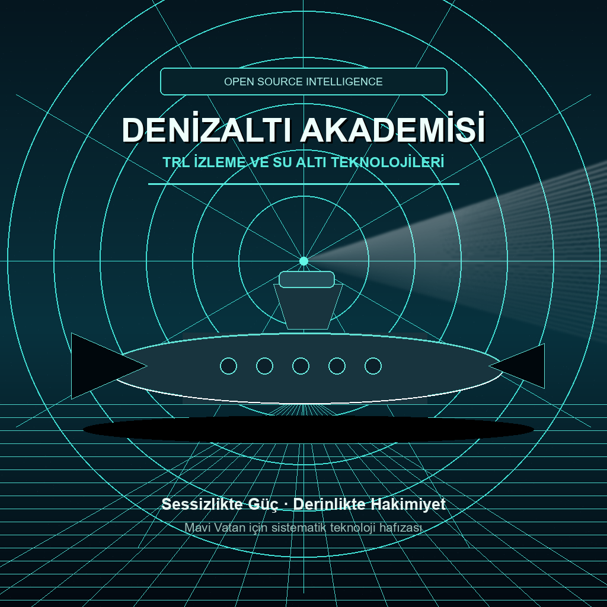

# 🌊 Denizaltı Akademisi

<div align="center">



[](https://opensource.org/licenses/MIT)
[](./TRL_REHBERI.md)
[](./docs/index.html)
[](http://makeapullrequest.com)

### TRL odaklı su altı teknolojileri, platform kıyasları ve açık kaynak savunma hafızası.

**Sessizlikte güç. Derinlikte hakimiyet. Veride disiplin.**

[🚀 Dashboard'u Aç](./docs/index.html) · [📊 TRL Rehberi](./TRL_REHBERI.md) · [📘 Sözlük](./SOZLUK.md) · [🤝 Katkı](./CONTRIBUTING.md)

</div>

---

## ⚓ Komuta Merkezi

| Rota | Ne Sağlar? |
| :--- | :--- |
| **[Etkileşimli TRL İzleme Paneli](./docs/index.html)** | Teknoloji alanlarını, TRL dağılımını ve dünya platformlarını filtrelenebilir bir dashboard üzerinde gösterir. |
| **[TRL Rehberi](./TRL_REHBERI.md)** | Denizaltı teknolojileri için TRL 1-9 ölçeğini ortak bir değerlendirme diline çevirir. |
| **[Denizaltı Sözlüğü](./SOZLUK.md)** | Termoklin, kavitasyon, baffles ve benzeri kritik kavramları hızlıca açıklar. |
| **[Katkı Rehberi](./CONTRIBUTING.md)** | Yeni analiz, düzeltme ve veri güncellemeleri için katkı standardını tanımlar. |

## ✨ Proje Kimliği

Denizaltı Akademisi; su altı harp teknolojilerini, denizaltı platformlarını ve gelişen mühendislik trendlerini **TRL (Technology Readiness Level)** perspektifiyle izleyen bir açık kaynak bilgi merkezidir.

Bu repo; dağınık teknik notları tek bir stratejik hafızada toplar, teknolojileri olgunluk seviyesine göre sınıflandırır ve araştırmacılar için okunabilir, doğrulanabilir, geliştirilebilir bir referans zemini sunar.

**Öne çıkanlar**

- **TRL tabanlı izleme:** Her teknoloji, fikir aşamasından operasyonel kanıta kadar ortak bir ölçekle takip edilir.
- **Alan bazlı teknoloji haritası:** İtki, savaş sistemleri, platform/gövde ve insansız sistemler ayrı modüllerde incelenir.
- **Küresel platform kıyasları:** Seawolf, Virginia, Yasen-M, Astute, Suffren ve diğer modern sınıflar tek çatı altında profilize edilir.
- **Statik dashboard:** GitHub Pages uyumlu, bağımlılıksız ve filtrelenebilir bir görsel izleme paneli içerir.
- **Doğrulama aracı:** Markdown bağlantıları ve dashboard veri bütünlüğü tek komutla kontrol edilir.

## 🎯 Vizyon

Bu proje, sadece bir veri deposu olmanın ötesine geçerek, denizaltı ve su altı harp teknolojilerini **Teknoloji Hazırlık Seviyesi (Technology Readiness Level - TRL)** perspektifiyle titizlikle izleyen, derinlemesine analiz eden ve stratejik bir hafıza oluşturan yeni nesil bir açık kaynak istihbarat ve bilgi merkezidir.

Temel amacımız, laboratuvar ortamındaki henüz filizlenen teorik konseptlerden (TRL 1), muharebe alanında rüştünü ispatlamış operasyonel sistemlere (TRL 9) kadar uzanan geniş ve karmaşık bir yelpazedeki projelerin gelişim yaşam döngülerini şeffaf, doğrulanabilir ve sistematik bir metodoloji ile takip etmektir. Bu sayede, savunma sanayii araştırmacılarına, mühendislerine ve karar vericilerine, su altı teknolojilerinin geleceği üzerine projeksiyon yapabilmeleri için nitelikli ve işlenmiş veri sunmayı hedefliyoruz.

---

## 🚦 Hızlı Başlangıç

Bu repo doğrudan okunabilir Markdown dokümanlarından ve bağımlılıksız bir statik dashboard'dan oluşur.

```bash
python -m http.server 8765
```

Ardından paneli açın:

```text
http://127.0.0.1:8765/docs/index.html
```

Veri ve bağlantı sağlığını kontrol etmek için:

```bash
python scripts/validate_academy.py
```

---

## 🧭 Teknoloji Radarları

Denizaltı harbi, çok disiplinli mühendislik dallarının en uç noktada birleştiği bir alandır. Bu bağlamda, teknolojileri birbirleriyle etkileşim içinde olan dört ana stratejik sütun altında sınıflandırarak izliyoruz. Aşağıdaki dashboard, bu kritik alanlara hızlı erişim sağlar:

| Teknoloji Alanı | Kapsam ve Odak Noktaları | Durum Takibi ve Proje Havuzu |
| :--- | :--- | :--- |
| **🚀 İtki ve Enerji Sistemleri** | Havadan Bağımsız Tahrik (AIP), Nükleer Reaktör Entegrasyonu, Lityum-İyon ve Katı Hal Batarya Teknolojileri, Hidrojen Yakıt Hücreleri ve Enerji Yönetim Sistemleri. | [Projeleri İncele ve Analiz Et](./01_ITKI_VE_ENERJI/PROJELER.md) |
| **⚔️ Savaş ve Silah Sistemleri** | Aktif/Pasif Sonar Dizileri, Akustik Sinyal İşleme, Ağır Torpidolar, Güdümlü Müzimmatlar, Elektronik Harp/Destek (ESM) ve Entegre Savaş Yönetim Sistemleri (SYS). | [Projeleri İncele ve Analiz Et](./02_SAVAS_SISTEMLERI/PROJELER.md) |
| **🚢 Platform, Gövde ve Malzeme** | Hidrodinamik Tekne Tasarımı, Yüksek Akma Mukavemetli Çelikler, Akustik Sönümleyici (Stealth) Kaplamalar, Titreşim İzolasyonu ve Korozyon Önleme. | [Projeleri İncele ve Analiz Et](./03_PLATFORM_VE_GOVDE/PROJELER.md) |
| **🤖 İnsansız ve Otonom Sistemler** | İnsansız Su Altı Araçları (UUV/AUV), Uzaktan Kumandalı Araçlar (ROV), Su Altı Planörleri (Gliders), Otonom Sürü (Swarm) Zekası ve İnsan-Makine Takımlaşması. | [Projeleri İncele ve Analiz Et](./04_INSANSIZ_SISTEMLER/PROJELER.md) |
| **🌐 Dünya Devleri (Top 10)** | Dünyanın en gelişmiş 10 denizaltı platformunun detaylı teknik analizleri. | [Aşağıdaki Listeye Git](#-dünya-devleri-en-gelişmiş-10-denizaltı-platformu) |

---

## 🖥️ İzleme Paneli

`docs/` altında yer alan dashboard; proje havuzunu alan, TRL bandı ve anahtar kelimeye göre filtreler. Panel tamamen statik çalışır; GitHub Pages, yerel HTTP sunucusu veya herhangi bir statik hosting üzerinde ek kurulum istemez.

| Panel Modülü | İçerik |
| :--- | :--- |
| **Alan kartları** | Dört ana teknoloji sütununu odak alanlarıyla listeler. |
| **TRL matrisi** | Projeleri TRL 1-3, 4-6 ve 7-9 bandına göre ayırır. |
| **Küresel platform grid'i** | Top 10 denizaltı profilini hızlı erişim bağlantılarıyla sunar. |
| **Veri dosyası** | [docs/data/projects.json](./docs/data/projects.json) üzerinden kolayca güncellenir. |

---

## 🌐 Dünya Devleri: En Gelişmiş 10 Denizaltı Platformu

Denizaltı harbinin zirvesini temsil eden, teknolojik açıdan en üstün 10 platform aşağıda listelenmiştir. Her biri için hazırlanan detaylı teknik analizlere ilgili bağlantılardan ulaşabilirsiniz.

### 1. 🇺🇸 [Seawolf Sınıfı (USA)](./05_DUNYA_DEVLERI/01_Seawolf_Class_USA/PROFIL.md)
> **"Okyanusların En Sessiz Avcısı"**
> Soğuk Savaş'ın zirve noktası. Aşırı maliyeti nedeniyle sadece 3 adet üretilen, akustik gizlilik ve derin deniz hakimiyeti konusunda halen rakipsiz kabul edilen nükleer taarruz denizaltısı.

### 2. 🇺🇸 [Virginia Sınıfı (Block V) (USA)](./05_DUNYA_DEVLERI/02_Virginia_Class_USA/PROFIL.md)
> **"Modüler Savaşçı"**
> ABD Donanması'nın belkemiği. Fotonik direkler (periskopsuz tasarım), gelişmiş kıyı harbi yetenekleri ve "Virginia Payload Module" ile 40 Tomahawk füzesi taşıyabilen stratejik vuruş gücü.

### 3. 🇷🇺 [Yasen-M Sınıfı (Rusya)](./05_DUNYA_DEVLERI/03_Yasen-M_Class_RUS/PROFIL.md)
> **"Doğu'nun En Tehlikeli Mızrağı"**
> Nükleer taarruz ve seyir füzesi denizaltısı hibriti. Hipersonik Zircon füzelerini ateşleyebilme kapasitesi ve Batı bloku denizaltılarıyla yarışan sessizlik özellikleriyle en büyük tehdit.

### 4. 🇬🇧 [Astute Sınıfı (Birleşik Krallık)](./05_DUNYA_DEVLERI/04_Astute_Class_UK/PROFIL.md)
> **"Duyan Kulaklar"**
> Dünyanın en gelişmiş sonar süitine (Thales 2076) sahip olduğu iddia edilir. Manş Denizi'nden okyanus ötesindeki gemileri takip edebilecek duyusal hassasiyete sahip sessiz bir güç.

### 5. 🇫🇷 [Suffren (Barracuda) Sınıfı (Fransa)](./05_DUNYA_DEVLERI/05_Suffren_Class_FRA/PROFIL.md)
> **"Kompakt Nükleer Güç"**
> Konvansiyonel denizaltı boyutlarında bir nükleer avcı. Hibrit itki sistemi, "X" dümen yapısı ve özel kuvvetler (Dry Deck Shelter) operasyonları için özelleştirilmiş çevik bir platform.

### 6. 🇩🇪🇳🇴 [Type-212CD (Almanya/Norveç)](./05_DUNYA_DEVLERI/06_Type-212CD_GER/PROFIL.md)
> **"Hayalet Form"**
> Dünyanın ilk "stealth" formlu denizaltısı. Elmas geometrisindeki dış gövdesi ile aktif sonar dalgalarını dağıtır ve hidrojen yakıt hücresi (AIP) ile haftalarca su altında kalabilir.

### 7. 🇯🇵 [Taigei Sınıfı (Japonya)](./05_DUNYA_DEVLERI/07_Taigei_Class_JPN/PROFIL.md)
> **"Lityum Devrimi"**
> AIP sistemini reddedip, tamamen Lityum-İyon batarya teknolojisine geçen ilk modern sınıf. Nükleer olmayan bir platformda, nükleere yakın su altı sürati ve sessizlik sunar.

### 8. 🇷🇺 [Borei-A Sınıfı (Rusya)](./05_DUNYA_DEVLERI/08_Borei-A_Class_RUS/PROFIL.md)
> **"Sessiz Kıyamet"**
> Rusya'nın yeni nesil balistik füze denizaltısı. Hidrodinamik mükemmelliği ve ilk kez kullanılan pump-jet itkisiyle, önceki Sovyet devlerine göre çok daha zor tespit edilen bir stratejik caydırıcı.

### 9. 🇰🇷 [KSS-III (Dosan Ahn Changho) (Güney Kore)](./05_DUNYA_DEVLERI/09_KSS-III_Batch-I_KOR/PROFIL.md)
> **"Konvansiyonel Stratejik Vuruş"**
> Nükleer olmayan (dizel-elektrik) bir denizaltıda Dikey Fırlatma Sistemi (VLS) ve Balistik Füze (SLBM) taşıyabilen dünyadaki nadir platformlardan biri.

### 10. 🇨🇳 [Type-039C (Yuan Sınıfı) (Çin)](./05_DUNYA_DEVLERI/10_Type-039C_CHN/PROFIL.md)
> **"Gizemli Ejderha"**
> İsveç A26 sınıfına benzer açılı "stealth" yelken (sail) tasarımına sahip ilk operasyonel denizaltı. Çin'in A2/AD (Erişimi Engelleme) stratejisinin en modern su altı unsuru.

---

## 📊 TRL (Teknoloji Hazırlık Seviyesi) Metodolojisi

Teknoloji Hazırlık Seviyesi (TRL), bir teknolojinin fikir aşamasından nihai kullanıma kadar olan olgunluk derecesini standartlaştıran evrensel bir ölçektir. Bu repoda, NASA ve NATO standartlarını temel alarak, denizaltı teknolojilerinin kendine has zorluklarını (yüksek basınç, korozyon, iletişim kısıtları) kapsayacak şekilde özelleştirilmiş bir TRL skalası kullanıyoruz.

👉 **[Detaylı Denizaltı TRL Rehberi ve Tanımları](./TRL_REHBERI.md)**

---

## 🛠️ Araştırma Metodolojisi ve Veri Doğrulama Süreçleri

Bu repoda sunulan bilgilerin doğruluğu ve güvenilirliği, akademik titizlikle yürütülen çok katmanlı bir doğrulama sürecine dayanmaktadır:

1.  **Açık Kaynak İstihbaratı (OSINT) ve Veri Madenciliği:** Resmi savunma sanayi başkanlıklarının faaliyet raporları, uluslararası savunma fuarlarındaki (IDEF, Euronaval vb.) lansmanlar, yüklenici firmaların (STM, Aselsan, Roketsan, TKMS, Naval Group) basın bültenleri ve güvenilirliği kanıtlanmış savunma analizi platformları taranarak ham veri toplanır.
2.  **Akademik Literatür Taraması:** Özellikle düşük TRL seviyelerindeki (TRL 1-4) teknolojiler için, hakemli dergilerde yayınlanan makaleler, doktora tezleri ve teknik konferans bildirileri incelenerek teorik altyapının sağlamlığı test edilir.
3.  **Topluluk Tabanlı Doğrulama (Peer Review):** GitHub topluluğu ve sektör uzmanlarının katkılarıyla veriler sürekli olarak gözden geçirilir. Hatalı veya güncelliğini yitirmiş bilgiler, "issue" ve "pull request" mekanizmalarıyla hızla düzeltilir.

> [!NOTE]
> Şeffaflık ilkemiz gereği, her projenin TRL seviyesi, erişilebilir en güncel ve doğrulanabilir veriye dayandırılır. Tahmine dayalı veya teyit edilemeyen bilgiler, analizlerde açıkça belirtilir veya kapsam dışı bırakılır.

---

## 🌍 Ekosistem, Paydaşlar ve Stratejik Bağlam

Bu çalışma, sadece teknik bir arşiv değil, aynı zamanda geniş bir ekosistemin yansımasıdır:

-   **Akademik Akademi:** Üniversitelerin Gemi İnşaatı, Oşinografi ve Elektrik-Elektronik fakülteleri, teorik bilginin ve temel araştırmaların (TRL 1-3) ana kaynağıdır.
-   **Endüstriyel Kompleks:** Tersaneler, savunma sanayi şirketleri ve teknoloji start-up'ları, bu teorik bilgiyi uygulanabilir prototiplere ve ürünlere (TRL 4-9) dönüştüren üretim gücüdür.
-   **Stratejik Doktrin:** Deniz Kuvvetleri ve politika yapıcılar, "Mavi Vatan" gibi doktrinlerle ihtiyaçları belirler ve teknolojinin kullanım konseptini çizer. Bu repo, bu üç sacayağının kesişim noktasında durmaktadır.

---

## 🗺️ Gelecek Vizyonu ve Yol Haritası (Roadmap)

Sürekli gelişim ilkesiyle, projenin kapsamını ve derinliğini artırmak için aşağıdaki hedefler belirlenmiştir:

-   **Q3 2024 - Teknik Derinleşme:** Takip edilen tüm projeler için teknik özelliklerin (menzil, derinlik, hız vb.) yer aldığı detaylı kimlik kartlarının oluşturulması.
-   **Tamamlandı - Görselleştirme:** Verilerin daha anlaşılır olması için TRL dağılımlarını ve teknoloji ağaçlarını gösteren interaktif, infografik tabanlı bir web arayüzü `docs/` altında hazırlandı.
-   **2025 - Küresel Kıyaslama:** Yerli projelerin, uluslararası muadilleriyle (Alman Type-214, Japon Taigei, Fransız Barracuda vb.) teknik ve takvimsel olarak karşılaştırıldığı kapsamlı analiz modülünün eklenmesi.

## ✅ Kalite Kontrol

Statik panel veri bütünlüğünü ve Markdown bağlantılarını kontrol etmek için:

```bash
python scripts/validate_academy.py
```

---

## 📚 Kaynakça ve Referans Kütüphanesi

Analizlerimiz, alanında otorite kabul edilen kaynakların çapraz referanslanmasıyla oluşturulur. Temel başvuru kaynaklarımız:
*   *SSB (Savunma Sanayii Başkanlığı) Yıllık Faaliyet Raporları ve Stratejik Planları*
*   *Deniz Kuvvetleri Dergisi ve Naval War College Review Makaleleri*
*   *Jane's Fighting Ships, Naval News ve Defence Weekly Analizleri*
*   *Google Scholar, IEEE Xplore ve ResearchGate Akademik Veritabanları*

---

## 📂 Arşiv ve Eski Dokümanlar (Legacy)

Bu reponun evrim sürecindeki önceki versiyonlarına, eski akademik notlara ve teorik dokümanlara erişmek isterseniz, bu içerikler tarihsel bütünlüğü korumak amacıyla `LEGACY` klasörü altında arşivlenmiştir:
- [LEGACY Klasörünü İncele](./LEGACY/)

---

## 🤝 Katkıda Bulunma ve İşbirliği

Bu proje, kolektif zekanın gücüne inanır. Yeni bir proje eklemek, mevcut bir veriyi güncellemek veya vizyonumuza katkıda bulunmak için lütfen [CONTRIBUTING.md](CONTRIBUTING.md) rehberini inceleyiniz (Hazırlanma aşamasındadır). Her türlü "Pull Request" ve "Issue" bildirimi titizlikle değerlendirilecektir.

---

## 👨‍💻 Mimar ve Geliştirici Hakkında

Bu proje, teknolojiye duyduğu derin tutkuyu, denizcilik stratejilerine olan ilgisiyle ve akademik disiplinle harmanlayan **Bahattin Yunus Çetin** tarafından tasarlanmış ve yönetilmektedir.

Bir **IT Architect** olarak, büyük ölçekli ve karmaşık sistemlerin mimari tasarımı, entegrasyonu ve dijital dönüşüm süreçleri üzerine profesyonel çözümler üretmekteyim. Aynı zamanda, **Trabzon, Of**'ta sürdürdüğüm üniversite eğitimimle teorik bilgimi sürekli güncel tutarken; savunma sanayii, otonom su altı sistemleri ve yapay zeka destekli denizcilik çözümleri üzerine Ar-Ge çalışmaları yürütmekteyim. Teoriyi pratikle, vizyonu mühendislikle birleştiren bir yaklaşımla, Türkiye'nin Mavi Vatan vizyonuna teknolojik bir perspektiften katkı sunmayı amaçlıyorum.

<div align="center">

[](https://github.com/bahattinyunus)
[](https://www.linkedin.com/in/bahattinyunus/)

</div>
